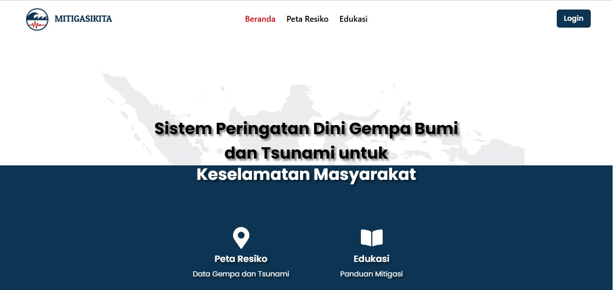
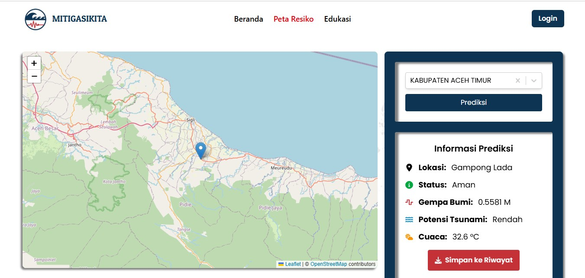
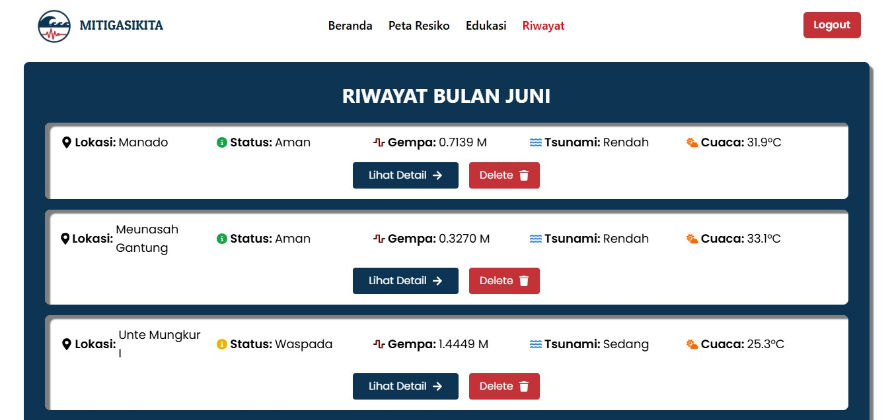

# Mitigasi Kita - Web App untuk Mitigasi dan Prediksi Bencana di Indonesia

"Mitigasi Kita" adalah aplikasi yang dirancang untuk membantu masyarakat Indonesia memahami dan mempersiapkan diri menghadapi berbagai potensi risiko dan bencana, seperti gempa bumi dan tsunami. Aplikasi ini mendukung peningkatan kesadaran publik dan kesiapsiagaan masyarakat dengan fitur interaktif dan informatif.


## Fitur Utama

- 🗺️ **Peta Resiko**: kondisi potensi bencana (gempa dan tsunami) berdasarkan lokasi yang dipilih.
- 📚 **Edukasi Mitigasi**: Panduan pemahaman dan kesiapsiagaan menghadapi bencana.
- 🧾 **Riwayat & Detail Aktivitas**: Menyimpan dan menampilkan catatan interaksi pengguna.
- 🔐 **Autentikasi**: Login, register, reset password.
- 📱 **Responsif & PWA**: Navigasi bawah tetap dan dapat dipasang di perangkat.

## Tampilan Aplikasi

## Beranda

## Peta Resiko

## Riwayat


## Teknologi yang Digunakan
- React + vite
- Leaflet + OpenStreetMap (Peta interaktif)
- SweetAlert2 (Notifikasi & Konfirmasi)
- Tailwind CSS (Desain responsif)

## Struktur Proyek
```
mitigasi-kita/
├── presenters/
├── public/
├── src
│    ├── assets
│    ├── components
│    ├── data  
│    ├── pages
│    ├── utils
│    ├── App.css
│    ├── App.jsx
│    ├── index.css
│    └── main.jsx
├── .gitignore
├── index.html
├── package.json
├── README.md
└── vite.config.js
```

## Arsitektur Proyek

Pola MVP (Model-View-Presenter):

- `pages/` – Komponen View: Menampilkan UI dan menerima input dari pengguna
- `presenters/` – Komponen Presenter: mengelola logika dan Menjembatani antara View dan Model.
- `utils/` – Komponen Model: mengatur komunikasi API dan pengelolaan data

## Prasyarat

- Node.js v18.x atau lebih tinggi
- npm (Node Package Manager)

## Setup dan Instalasi
```bash
git clone https://github.com/lizia20/mitigasi-kita.git
cd mitigasi-kita
npm install
npm run dev
```

## Kontribusi

Silakan fork epositori ini dan ajukan pull request.

## Lisensi

MITIGASIKITA © 2025 - Tim MitigasiKita
